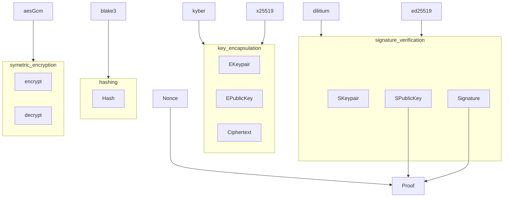
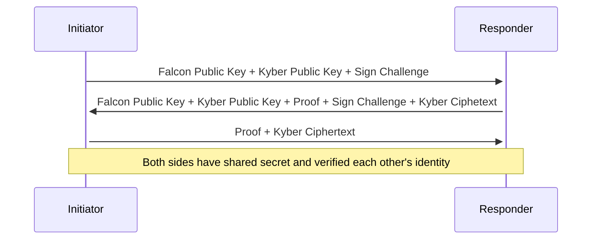
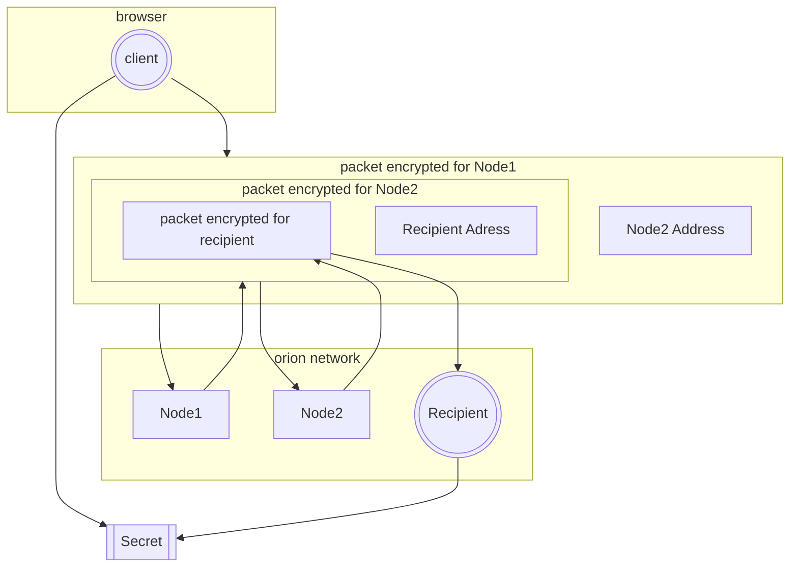
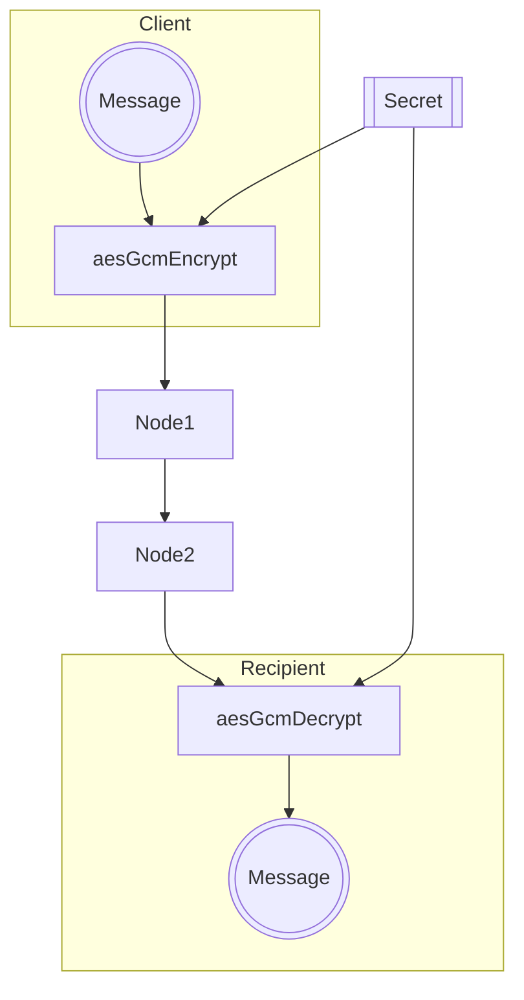
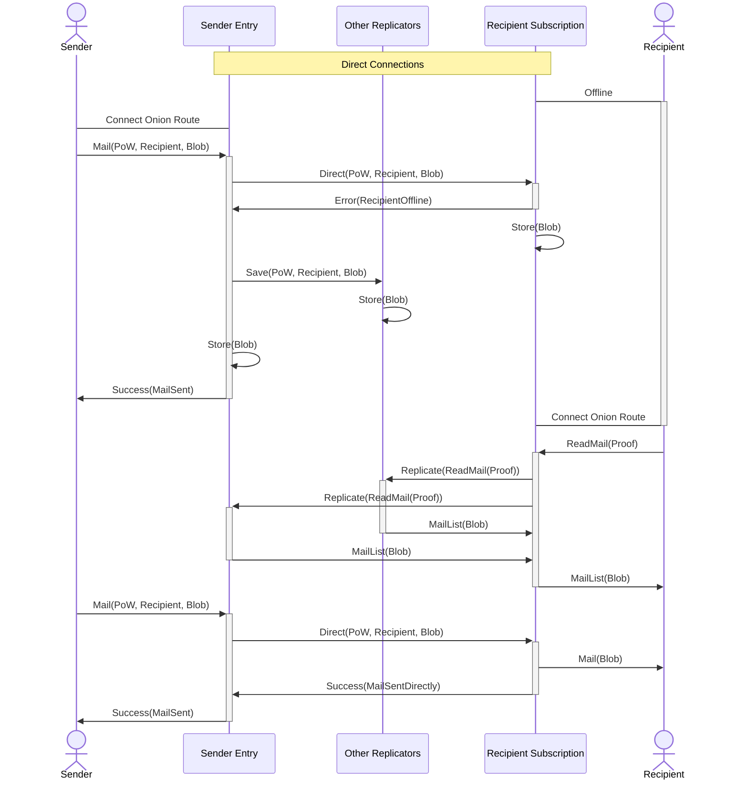
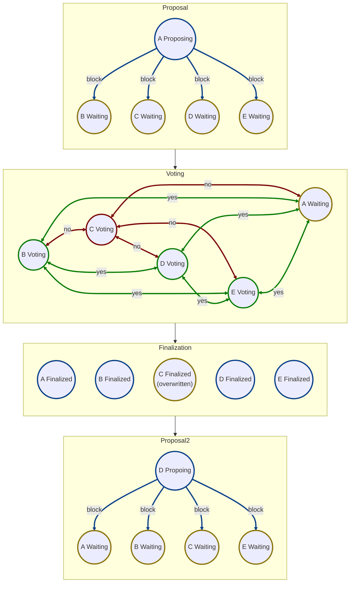

# Fundamentals

## Core encryption primitives

We use Kyber and Falcon for post-quantum secure key exchange and signatures. Each lattice based algorithm is complemented with ecliptic counterpart for redundancy. After key exchange, we use AES-GCM to encrypt messages at transit, because it ensures integrity and authenticity of the messages. For generic hashing we chose Blake3.

## Post-Quantum Transport Layer Security (PQTLS)

Network uses custom post-quantum handshake based of Falkon for identity verification and Kyber for key exchange. We decided to make our own since we only communicate within the network and standards like **Noise** or **TLS** either aren't post-quantum secure or don't work in browsers. Besides, its trivial to implement.

## Onion routing

We use onion routing as a form of decentralized VPN. Since we only need to relay requests to servers within the network, we don't need to be compatible with any existing TOR network. Key differences form TOR (as an example):

- we always use 2 relays
- we use our own encryption scheme based of Kyber
- the protocol is browser agnostic (we only require reliable connection)

### Setup

Before sending any messages, **sender** and **recipient** needs to establish a **shared secret** without recipient or relays knowing where client is. This is done with initialization **packet** that has multiple layers of encryption to hide full path from relays and server.

## Communication

After the initialization packet gets delivered, both sides have **shared secret** and can simply use AES-GCM to encrypt and decrypt messages on transit. In this case we don't need need multiple layers of encryption, since route is established and nodes only forward encrypted stream.

# The Message Relay Network

The network provides most flexible, bare minimum to implement highly secure peer to peer, ephemeral messaging. Exposed API makes no assumption about format and encryption to the extent that two clients can not understand each other. This is simpler to implement and allows for more types of clients.

## Distributed Hash Table

Location of any data related to users is stored on the network with deterministic location. Since all nodes need to stake on chain, their public key and IP address is publicly known. User with full topology can compute which nodes are the closest to the given key (XOR distance). This is magnitudes more performant the using Dynamic DHT like Kademlia (for our use-case). Nodes can listen for events form the block-chain to always have synchronized topology.

## User Profiles

Main feature of the network is to relay ephemeral messages. Users of the network are identified by their public key that also decides which nodes in the network store their profile information. As long as you know users public key, you know where his profile is, which is necessary to send ephemeral messages.

## Mailbox

Each user profile has associated file (**mailbox**) that stores sequence of **mail**. Mail is simply an arbitrary blob that was sent by another user when profile owner is offline. Nodes cap the mailbox size and sender needs to perform proof of work to send the mail. In other cases, when user is online, the mail is sent directly, without being stored in the mailbox. Owner has permission to read the **mailbox** which clears it. Thus messages sent trough the mail are ephemeral.

## Profile Vault

User need to be able to store arbitrary data permanently to ensure they don't loose things like friend list and associated secrets (Double-Ratchet). Users might also want to pin arbitrary data to their profile for others to view. For this reason, every profile has associated key value store with limited capacity. Changes to the store are authenticated by signature of Merkle-Tree root that nodes in replication group and users can verify. Values in the vault are opaque to the nodes and clients specify how and what they store there.

# Message Block Chain

Another feature network offers is message blockchain with access control. This form of messaging allows for scalable and archivable community-like chats. This is achieved with distributed random function consensus.

## DRF Consensus

Nodes need to synchronize the order of message history so it has consistent hash, for this one of the nodes is choosen whith pseudorandom function seeded by previous block hash. Each node vaidates the block and send his vote to others. When node accumulate either no or yes majority they will accept of delete the block.

